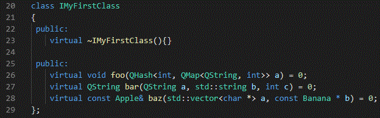
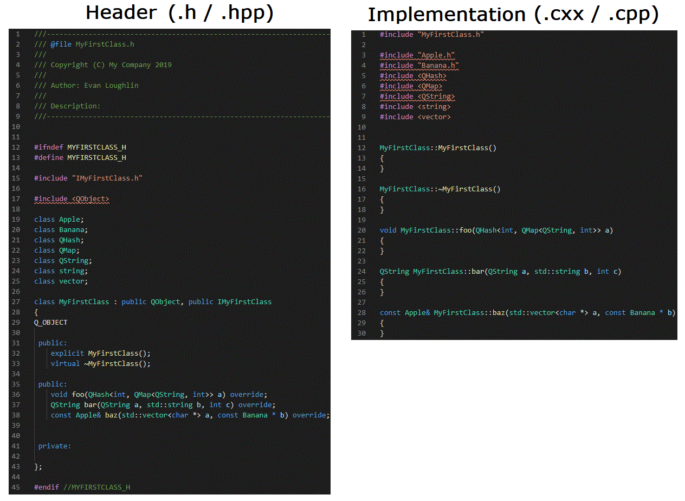
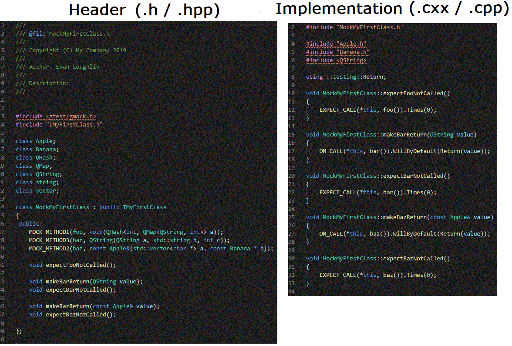
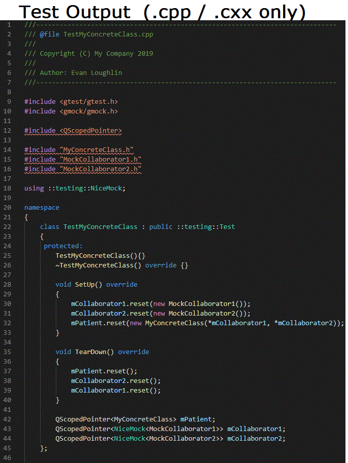
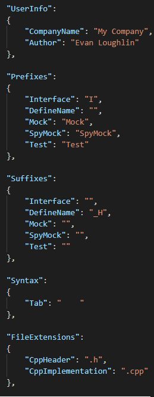
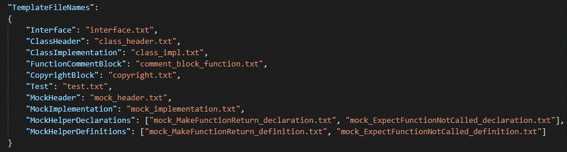

# CppCodeGenerator

[](https://hits.seeyoufarm.com)

## C++ Code Generation Tools

A project for generating boilerplate C++ code from user-provided template files (.txt), and user-defined configurations (config.json).

### Files that can be generated:
- Interfaces
- Class Headers (.h / .hpp) and Implementations (.cpp / .cxx)
- Mock Classes (GoogleMock)
- Test Classes (GoogleTest)

### Status 
Complete (but accepting feedback and making changes as required)

## Dependencies
- Go 1.13 +

## Installation
```
git clone https://github.com/emloughl/CppCodeGenerator.git
cd CppCodeGenerator
mkdir build && cd build
go build ..
```

## Usage
### Arguments
#### Class Type
` -t ` or `--type`: Specifies the type of class to be generated. 
 - Allowed values: `interface`, `class`, `mock`, or `test`.

#### Path to Existing Interface
` -i` or `--interface`: Specifies the path to a user's existing C++ interface from which to generate another class.

#### Class Name
` -n` or `--class`: Specifies the name of the class to be generated.

#### Author Name (Optional)
` -a` or `--author`: Specifies the author's name (overrides the default value in config.json)

## Generating an Interface
#### Command:

```
CppCodeGenerator --type interface --name MyFirstClass
```
 
 
#### Output:


## Generating a Class (Header and Implementation)
#### First Complete your Interface
To generate a class, you require an interface from which to implement. The first step is to define your interface's pure virtual functions. In this example, we'll define three pure virtual functions, `foo`, `bar`, and `baz`. Each of them with intentionally convoluted signatures to demonstrate the generator's capabilities.



Now, we'll generate a class that inherits `IMyFirstClass.h`:

#### Command:
```
CppCodeGenerator --type class --interface ./path/to/interface/IMyFirstClass.h
```

 

#### Output:
 
 
##### Cleanup May Be Required!
The program doesn't handle including and forward declaring of all types perfectly! Some cleanup may be required, particularly for templated types like QMap<> and QHash<>.
 
 #### Class Naming
 ```
 CppCodeGenerator --type class --interface ./path/to/interface/IMyFirstClass.h --name UniqueClass
 ```
By default, the program generates a class name based on the interface's name. To specify a different name, use the `-n` or `--name` option. 
 

## Generating a Mock
#### First Complete your Interface
Just like generating a class, a completed interface is required. As an example, we'll use the same `IMyFirstClass.h` interface previously defined.

#### Command:
```
CppCodeGenerator --type mock --interface ./path/to/interface/IMyFirstClass.h
```
 

#### Output:
 

## Generating a Test
Generating a test requires only the name (not the path) of the desired concrete class to test.
#### Command:
```
CppCodeGenerator --type test --name MyConcreteClass
```
 
 
#### Output:
 

## Configurations

Modifying the `config.json` file allows you to alter your desired prefixes, suffixes, and other policies.

#### Prefixes, Suffixes, Formatting Syntax, and File Extensions
The following fields can be modified:

 
 
#### Policies
Currently the following policies can be modified:
##### DefineNameAllCapsEnabled
Sets whether a define name, such as `#ifndef MYCLASS_H`, will be capitalized.

##### DefineNameCamelCaseSeparator
Define names are generated based on the class name. The DefineNameCamelCaseSeparator describes the separator characters that will be placed between words of a camel-case class.

Example:
With `"DefineNameCamelCaseSeparator": "_"`, and a DefineName Suffix = `"_H`, a class named `MyNewClass` will have a generated define name of `MY_NEW_CLASS_H`.

##### Date Format: 
Follow the Golang date format. Example here: https://stackoverflow.com/questions/20234104/how-to-format-current-time-using-a-yyyymmddhhmmss-format

#### Template File Names
The program relies on user-defined template .txt files to generated classes. The `config.json` file describes the names of the templates to use. These templates must be located within the Templates Directory.



## Modifying Template Files
All the generated classes are derived from user-defined templates in .txt format. 

#### Templates Directory
All templates must be located here:
https://github.com/emloughl/CppCodeGenerator/tree/master/resources/templates

Users are free to modify existing templates, or create their own. If a user creates their own, the new template file name must be populated in `config.json`, and located within the templates directory.

### Fields
Within template files, fields are indicated by the presence of curly braces, e.g. `{{Class.Header.DefineName}}`. During generation, the program identifies these fields and replaces them accordingly. 

#### General

Field | Gets Replaced With
--- | --- 
`{{Copyright}}` | Contents of `copyright.txt`
`{{FileName}}` | Generated filename
`{{UserInfo.Author}}` | Author as configured in `config.json`
`{{UserInfo.Company}}` | Company as configured in `config.json`
`{{Date}}` | Current date of file being generated, as formatted in `config.json`

#### Interface

Field | Gets Replaced With
--- | --- 
`{{Interface.DefineName}}` | Define name of interface
`{{Interface.Name}}` | Interface name

#### Class

Field | Gets Replaced With
--- | --- 
`{{Class.Header.DefineName}}` | Class header's define name
`{{Class.Header.Includes}}` | Sorted includes to be found in the class header
`{{Class.Implementation.Includes}}` | Sorted includes to be found in the class implementation
`{{Class.Header.ForwardDeclares}}` | Sorted forward declares of all types used within the inherited interface
`{{Class.Name}}` | Class name
`{{Interface.Name}}` | Name of interface that the class is inheriting
`{{Interface.FileName}}` | Filename of interface that the class is inheriting
`{{Class.Header.FileName}}` | Filename of class header
`{{Class.Header.FunctionDeclarations}}` | Function declarations (as per the pure virtual functions declared in the interface)
`{{Class.Implementation.FunctionDefinitions}}` | Function definitions (as per the pure virtual functions declared in the interface)

#### Mock

Field | Gets Replaced With
--- | --- 
`{{Mock.InheritedInterface.FileName}}` | Name of interface that the mock is inheriting
`{{Mock.ForwardDeclares}}` | Sorted forward declares of all types used within the inherited interface
`{{Mock.Header.Includes}}` || Sorted includes for the Mock header
`{{Mock.Header.DefineName}}` || Define name for Mock Header
`{{Mock.Implementation.Includes}}` || Sorted includes for the Mock implementation
`{{Mock.Name}}` | Mock name
`{{Mock.Header.FileName}}` | Mock header filename
`{{Mock.InheritedInterface.Name}}` | Name of interface that the class is inheriting
`{{GMockMacros}}` | Result of GoogleMock gmock_gen.py, formatted. Refer to GoogleMock documentation: https://github.com/google/googletest/blob/master/googlemock/docs/for_dummies.md
`{{Mock.HelperFunctions.Declarations}}` | Mock helper functions, as defined in `config.json`'s reference to helper function templates.
`{{Class.Header.FunctionDeclarations}}` | Function declarations (as per the pure virtual functions declared in the interface)
`{{Class.Implementation.FunctionDefinitions}}` | Function definitions (as per the pure virtual functions declared in the interface)
`{{Mock.HelperFunctions.Definitions}}` | Helper function definitions

#### Test
Field | Gets Replaced With
--- | ---
`{{Test.ConcreteFileName}}` | The tested class' filename
`{{Test.Name}}` | Name of test harness

## Modifying Include / Forward Declare Types
The `.txt` files located in https://github.com/emloughl/CppCodeGenerator/tree/master/resources/include-lists, help improve the mapping of data types from pure virtual functions declared in interfaces, to forward declares and includes. 

### Qt Classes
The `qt-includes.txt` file lists all Qt classes. Any class in this file, if used in an interface, will be included with `<` and `>`, such as `#include <QObject>`. User-defined types would be included with `"`, such as `#include "MyNewClass.h"`.

### Std Types
The `std-types.txt` file lists all standard types (i.e. int, char, etc.), for which no include or forward declare is necessary.

### Mapped Includes
The `mapped-includes.txt` file lists a dictionary of key-value pairs, such that if the parsing of an interface encounters the key, it will include or forward declare the corresponding value.

For example:
`std::vector vector` will cause the use of `std::vector` in a pure virtual function to create an include of `#include <vector>`. Without this key-value pair, the result would erroneously be `#include "std::vector.h"`.

This file allows users to add types as required to improve the utility of the generator.

### Types to Include in Header
The `include-in-header.txt` file lists data types that should be included in the header, rather than forward declared, when that type is detected within the interface. Add data types to this file as needed.

For example, consider the following items in `include-in-header.txt`:
```
 vector
 string
 map
```

An an interface with the following pure virtual interface:
```
 virtual std::vector<std::string> foo(std::map<int, std::string>) = 0;
```

The includes in the generated header would be:
```
 #include <vector>
 #include <string>
 #include <map>
```
