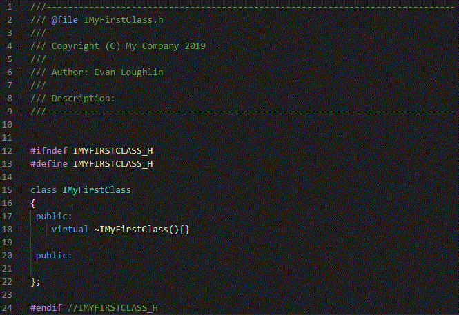

# CppCodeGenerator
## C++ Code Generation Tools

A project for generating boilerplate C++ code from user-provided template files (.txt).

### Files that can be generated:
- Interfaces
- Class Headers (.h)
- Class Implementations (.cpp / .cxx)
- Mock Classes
- Test Classes

## Dependencies
- Go 1.13 +

## Installation
```
git clone https://github.com/emloughl/CppCodeGenerator.git
cd CppCodeGenerator
mkdir build && cd build
go build ..
```

## Usage
### Arguments
##### Class Type
` -t ` or `--type`: Specifies the type of class to be generated. 
 - Allowed values: `interface`, `class`, `mock`, or `test`.

##### Path to Existing Interface
` -i` or `--interface`: Specifies the path to a user's existing C++ interface from which to generate another class.

##### Class Name
` -n` or `--class`: Specifies the name of the class to be generated.

## Generating an Interface
##### Command:

```
CppCodeGenerator -t interface -n MyFirstClass
```
 
 
##### Output:



##### Creating a new (blank) interface:
```
NewClass.exe -type=interface -interface=/path/to/I_MyNewClass.h
```

This will create a new interface with the name `I_MyNewClass.h` at the specified path. Note that the `I_` prefix must match what is specified in the configuration file `config.json`.


##### Creating a new class that inherits a given interface:
```
 $ NewClass.exe -type=class -interface=C:/ws/I_MyClass.h
```
Output:
    Will create 2 files: `MyClass.h`, and `MyClass.cpp`. 


### Configurations

Modifying the `config.json` file allows you to alter your desired prefixes, suffixes, and other policies.

#### Date Format: 
Follow the Golang date format. Example here: https://stackoverflow.com/questions/20234104/how-to-format-current-time-using-a-yyyymmddhhmmss-format

## TODO:
Add list in README of all possible template parameters
